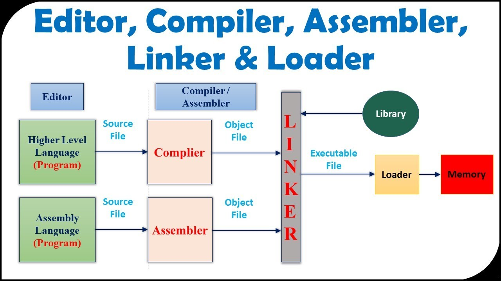
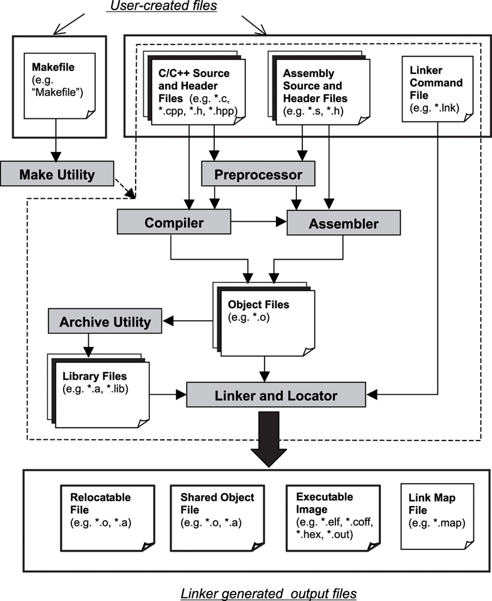
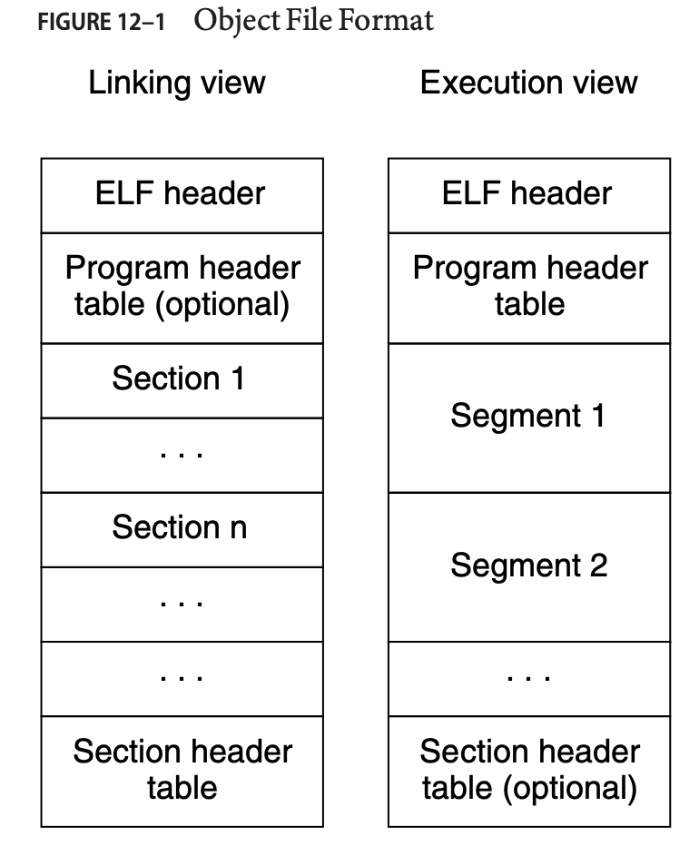
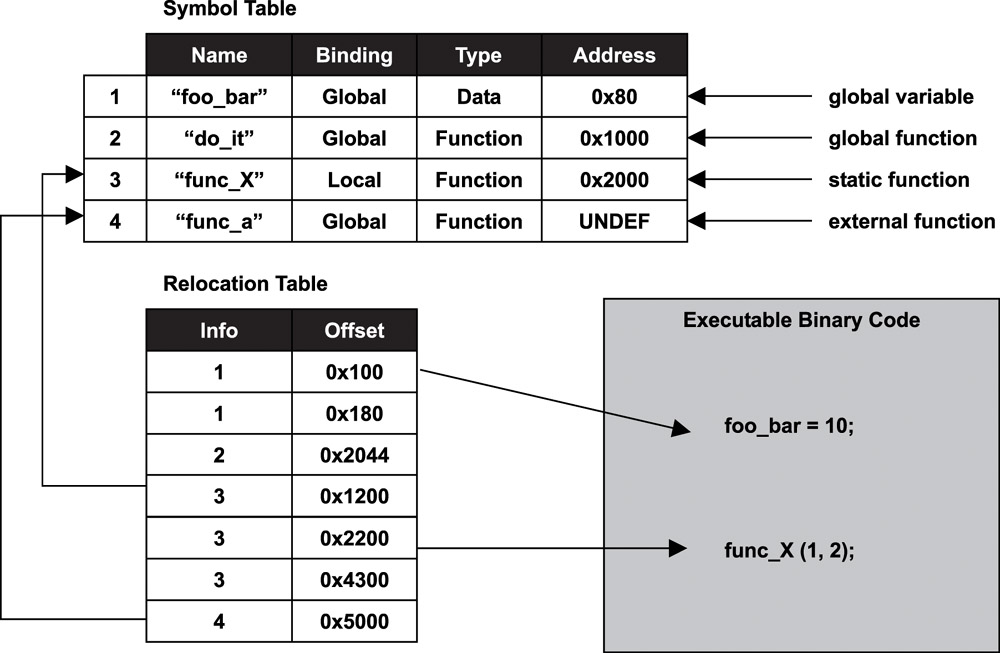

nm - an abbreviation for "names" or "name list" -  Display the Symbol Table of a Binary Object File

a tool for examining the contents of object files, archives, and shared libraries.


nm /bin/ls
nm: /bin/ls: no symbols

nm /usr/lib/gcc/x86_64-linux-gnu/8/
nm: Warning: '/usr/lib/gcc/x86_64-linux-gnu/8/' is a directory

ELF — Linux manual page
https://man7.org/linux/man-pages/man5/elf.5.html

read alongside with

https://www.ics.uci.edu/~aburtsev/238P/hw/hw3-elf/hw3-elf.html

nm man page https://man7.org/linux/man-pages/man1/nm.1.html

mmap man page https://man7.org/linux/man-pages/man2/mmap.2.html

fstat man https://linux.die.net/man/2/fstat

===

Compilers and assemblers create object files containing the generated bi- * nary code and data for a source file. Linkers combine multiple object files * into one, loaders take object files and load them into memory.

symbols are generated in the compile and assembly phases, and then used in the linking and loading phases to create a complete executable or shared library.

 

 

```
$ nm hello.o
00000000 T main
                U printf
T before “main” signifies it is in the text section and the “U” before printf means it is undefined in this code. The first column gives the value of the symbol.
```

```
hexdump a.out | head -n 1
0000000 457f 464c
```

32 Little-endian: 
7f 45 4c 46 (ELF)

64-bit Little-endian: 
7f 45 4c 46 02 01 01 00 (ELF header)

The four-byte sequence 7f 45 4c 46 corresponds to the ASCII values of the characters '\x7f', 'E', 'L', and 'F', respectively. 


In-depth: ELF https://youtu.be/nC1U1LJQL8o

ELF File https://youtu.be/1VnnbpHDBBA

ELF File Header https://youtu.be/5MJW71jftQU

ELF Section Header https://youtu.be/L9okXJH5l2Y

ELF Format Cheatsheet

https://gist.github.com/x0nu11byt3/bcb35c3de461e5fb66173071a2379779


sections vs segments(program)

sections and segments overlap

 

sections(file view of the binary) = describe the layout of the binary in its file form , while  the seg describe the binary as it looks when it is loaded into memory. 

section headers describe the layout of the sections

text = code

ro data = readOnly data

data = initialized global vars

bss = uninitialized vars 


https://youtu.be/hoLYnS2jOV8

Linker

https://youtu.be/-UBVQPu5tQo

Linux Executable Symbol Relocation

https://youtu.be/E804eTETaQs


mmap

https://youtu.be/rPV6b8BUwxM

https://youtu.be/m7E9piHcfr4

malloc, sbrk, and mmap

https://youtu.be/c7xf5dvUb_Q


https://medium.com/a-42-journey/nm-otool-everything-you-need-to-know-to-build-your-own-7d4fef3d7507


In the ELF file format, the .symtab, .strtab, and .shstrtab sections are special sections that contain important information about the symbols, strings, and section headers in the file.

1/ .symtab section: This section contains the symbol table, which is a data structure used by the linker to resolve references between different object files or libraries. The symbol table contains information about the symbols defined or referenced in an object file or executable, including their names, types, and locations in memory.

2/ .strtab section: This section contains a string table, which is a table of null-terminated strings used by various sections in the ELF file, including the symbol table entries in the .symtab section. The strings in the string table are referenced by their offset from the start of the section.

3/ .shstrtab section: This section contains a string table that stores the names of all the sections in the ELF file, including the .symtab and .strtab sections. This allows programs to locate and use the various sections in the file, including the symbol table and string table.

====

https://docs.oracle.com/cd/E23824_01/html/819-0690/chapter6-79797.html (https://docs.oracle.com/cd/E23824_01/pdf/819-0690.pdf)


String Table Section

String table sections hold null-terminated character sequences, commonly called strings. The
object file uses these strings to represent symbol and section names. You reference a string as an
index into the string table section.

Elf32_Sym->st_name

An index into the object file's symbol string table, which holds the character representations
of the symbol names.

==

symbol's type and binding attributes

=> Symbol type refers to the kind of symbol that is being defined or referenced.
 The most common symbol types include:

Object symbols: These symbols represent data objects, such as variables and constants.

Function symbols: These symbols represent functions or procedures.

Section symbols: These symbols represent sections of a program or library, such as code, data, or debug information.

File symbols: These symbols represent files or libraries that are being linked together.



=> Symbol binding refers to the visibility and accessibility of a symbol.
 The most common symbol bindings include:

Local binding: A local symbol is only visible within the scope of the module where it is defined. It cannot be accessed by other modules or libraries.

Global binding: A global symbol is visible and accessible across multiple modules or libraries. It can be accessed by other modules or libraries that link with the module where the symbol is defined.

Weak binding: A weak symbol is a symbol that can be overridden by a strong symbol with the same name. If a strong symbol is defined, it takes precedence over the weak symbol.

The role of symbol types and bindings is to provide information to the linker and loader about how to resolve and link symbols across different parts of a program or library.

====

The & operator is used to check if a certain flag is set in the section flags, while the | operator is used to check if a combination of flags is set.

For example, in the line 

`if ((file->shdr32[section].sh_flags & (SHF_ALLOC | SHF_WRITE)) == (SHF_ALLOC | SHF_WRITE))`

 the & operator is used to check if both SHF_ALLOC and SHF_WRITE are set in the section flags, while the == operator is used to check if both flags are set and no other flags are set.

In the line if ((file->shdr32[section].sh_flags & (SHF_ALLOC | SHF_EXECINSTR | SHF_WRITE)) == SHF_ALLOC), the & operator is used to check if the SHF_ALLOC flag is set and the SHF_EXECINSTR and SHF_WRITE flags are not set. The == operator is used to check if only the SHF_ALLOC flag is set and no other flags are set.

==

ELF32_ST_BIND is a value that specifies the binding of the symbol. It describes the linkage between the symbol and its definition or reference. There are four possible bindings: STB_LOCAL, STB_GLOBAL, STB_WEAK, and STB_LOOS to STB_HIOS, which represent local, global, weak, and operating system-specific bindings, respectively.

ELF32_ST_VISIBILITY is a value that specifies the visibility of the symbol. It controls whether the symbol is visible outside of the object file or executable. There are two possible visibility values: STV_DEFAULT and STV_HIDDEN. 